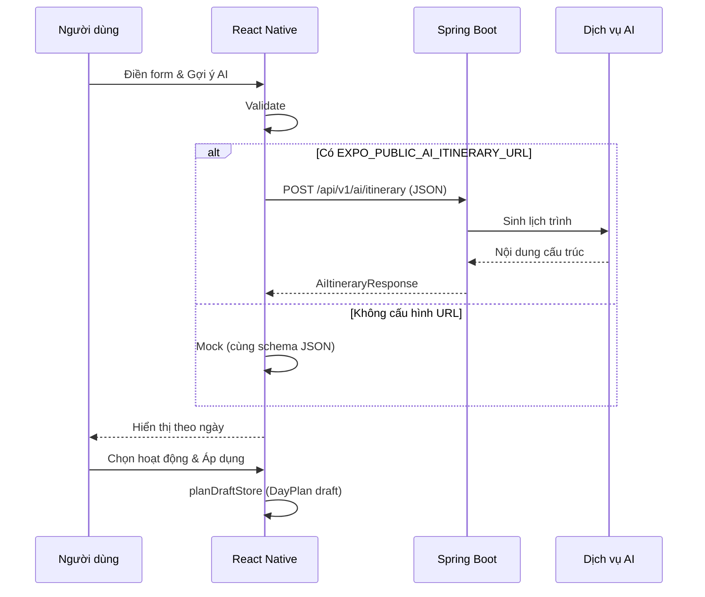

# Phụ lục báo cáo — Use case 4: Gợi ý lịch trình nhanh (AI)

**Toàn bộ mã nguồn frontend hiện tập trung vào UC-04; không triển khai các use case khác trong cùng repo.**

*Tài liệu này có thể đưa nguyên vào báo cáo Word/PDF hoặc trích phần mục lục.*

## 1. Tên use case

**UC-04 — Gợi ý lịch trình bằng AI và áp dụng vào kế hoạch nháp**

## 2. Tác nhân

- **Người dùng đã đăng nhập** (trong phạm vi đồ án có thể giả định; màn hình không bắt buộc token để demo).
- **Hệ thống** (frontend + backend + dịch vụ AI).

## 3. Tiền điều kiện

- Người dùng đang tạo hoặc chỉnh sửa **kế hoạch chuyến đi** (trạng thái draft — trong code demo, dữ liệu nháp lưu cục bộ sau bước “Áp dụng”).

## 4. Hậu điều kiện thành công

- Hệ thống hiển thị lịch gợi ý theo ngày; người dùng chọn hoạt động; khi xác nhận, **DayPlan** được cập nhật trong bộ nhớ ứng dụng (`applyDayPlansToDraft`), sẵn sàng đồng bộ sang **Spring Boot + MySQL** qua API lưu kế hoạch (phần mở rộng).

## 5. Luồng chính (mô tả theo bước)

| Bước | Người dùng | Hệ thống |
|------|------------|----------|
| 1 | Mở màn **Chatbot lịch trình AI** | Bot chào; hỏi **điểm đến** (gõ hoặc chip gợi ý) |
| 2 | Trả lời **số ngày** (1–14), **sở thích** (chip + “Xong”), **ngân sách** (chip), **ngày bắt đầu** hoặc Bỏ qua | Bot xác nhận từng bước trong khung chat |
| 3 | Xem **tóm tắt**; bấm **Gợi ý lịch ngay** | Kiểm tra dữ liệu; gọi `POST` API (hoặc mock); tin nhắn “Đang gọi AI…” |
| 4 | — | Trả về `summary` + `days` (hoạt động + nhà hàng), hiển thị dưới khung chat |
| 5 | Bật/tắt hoạt động; Chỉnh sửa; Chọn/Bỏ cả ngày; hoặc **Chat mới** | Cập nhật UI |
| 6 | “Áp dụng vào kế hoạch nháp” | Gom `DayPlan[]`, `applyDayPlansToDraft`, thông báo thành công |

## 6. Luồng ngoại lệ

| Tình huống | Xử lý |
|------------|--------|
| Số ngày không hợp lệ hoặc thiếu điểm đến | Hiển thị thông báo lỗi trên form, không gọi API |
| API lỗi mạng / HTTP | Hiển thị thông báo lỗi, cho phép thử lại |
| Không chọn hoạt động nào mà nhấn áp dụng | `Alert`: yêu cầu chọn ít nhất một hoạt động |

## 7. Sơ đồ tuần tự (gợi ý chèn vào báo cáo)

## 8. Contract API (khớp `types/aiItinerary.ts`)

**Endpoint đề xuất:** `POST /api/v1/ai/itinerary`  
**Content-Type:** `application/json`

**Body (request):**

| Trường | Kiểu | Bắt buộc | Mô tả |
|--------|------|----------|--------|
| destination | string | Có | Tên điểm đến |
| dayCount | number | Có | 1–14 |
| preferences | string[] | Có | Danh sách sở thích (nhãn tiếng Việt) |
| budgetTier | string | Có | `low` \| `medium` \| `high` |
| startDate | string | Không | ISO date, ví dụ `2026-04-10` |

**Body (response):**

| Trường | Mô tả |
|--------|--------|
| summary | Tóm tắt văn bản |
| days | Mảng: `dayIndex`, `label`, `activities[]`, `restaurants[]` |
| generatedAt | ISO timestamp |

Mỗi `activity` cần có `id` ổn định để UI quản lý Switch; `restaurant` tương tự.

## 9. Gợi ý minh chứng nộp bài

- Ảnh chụp màn hình: form nhập liệu → kết quả theo ngày → một ngày với gợi ý nhà hàng.
- Ảnh: thông báo sau “Áp dụng vào kế hoạch nháp”.
- (Tuỳ chọn) Ảnh Postman gọi API Spring Boot trả JSON đúng schema.

## 10. Hướng mở rộng (ghi trong phần kết luận báo cáo)

- Lưu `DayPlan` vào MySQL qua `PUT/PATCH` kế hoạch.
- Xác thực JWT từ Spring Security trên header `Authorization`.
- Ghi log gọi AI và giới hạn rate theo user.
