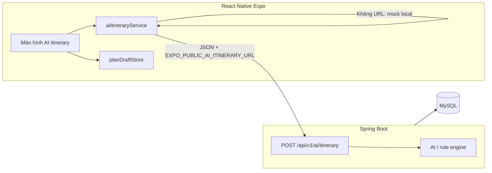

# Ứng dụng du lịch (Travel App) — Frontend

**Phạm vi đồ án: chỉ mục 4 — “Nhờ AI gợi ý lịch trình nhanh”.** Các màn hình khác (đăng ký, booking, bản đồ…) không nằm trong phần này.

Repository: **React Native + Expo**. Backend tùy chọn: **Spring Boot + MySQL** (API gợi ý lịch).

## Mục tiêu nghiệp vụ (UC-04)

Giao diện **chatbot** (mục 4) cho phép:

1. **Hội thoại** thu **điểm đến**, **số ngày**, **sở thích**, **ngân sách tham khảo**, (tuỳ chọn) **ngày bắt đầu** — có nút gợi ý nhanh và ô nhập.
2. Sau khi **xác nhận tóm tắt**, gửi yêu cầu tới **dịch vụ AI** (Spring Boot) hoặc **bản demo** nếu chưa cấu hình URL.
3. Nhận lịch **theo từng ngày**: điểm thăm, thời gian ước tính, **nhà hàng**.
4. **Duyệt / chỉnh sửa** từng hoạt động, **áp dụng** thành **DayPlan nháp** (`planDraftStore`).

## Kiến trúc tổng thể



## Công nghệ

| Lớp | Công nghệ |
|-----|-----------|
| Frontend | React Native 0.81, Expo SDK 54, Expo Router, TypeScript |
| UI | Component tái sử dụng (`Button`, `Card`, `Input`), theme sáng/tối |
| Backend (tham chiếu báo cáo) | Spring Boot REST, MySQL |

## Cấu trúc thư mục (phần liên quan BTL)

```
app/
  ai-itinerary.tsx      # Luồng UC: gợi ý AI → duyệt → áp dụng DayPlan
  (tabs)/index.tsx      # Điều hướng vào màn AI
services/
  aiItineraryService.ts # Gọi API hoặc mock có cùng contract JSON
types/
  aiItinerary.ts        # Request/Response & DayPlan (khớp backend)
stores/
  planDraftStore.ts     # Lưu tạm DayPlan sau khi người dùng xác nhận
```

## Cài đặt và chạy

```bash
npm install
npx expo start
```

Mở bằng Expo Go, emulator hoặc `w` cho web. Trên **Trang chủ**, chọn **“Gợi ý lịch trình bằng AI”** hoặc nút **sparkles** bên phải.

## Tích hợp Spring Boot

1. Sao chép `.env.example` thành `.env` và điền URL endpoint (ví dụ `http://10.0.2.2:8080/api/v1/ai/itinerary` khi emulator Android trỏ tới máy host).
2. Hoặc trong `app.json` → `expo.extra.aiItineraryUrl`.
3. Backend trả về JSON đúng schema trong `types/aiItinerary.ts` (xem thêm **`BAO_CAO_PHAN_4.md`**).

Nếu **không** đặt URL, app tự dùng **mock** để demo và quay video báo cáo.

## Tài liệu kèm báo cáo

- **`BAO_CAO_PHAN_4.md`**: Mô tả chi tiết use case, luồng xử lý, contract API, gợi ý chụp màn hình / checklist nộp bài.

## License

Dự án học tập — điều chỉnh theo yêu cầu giảng viên.
